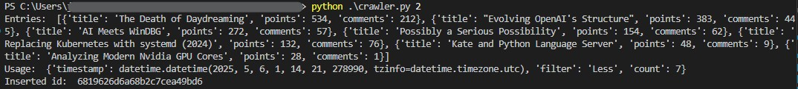

# Web Crawler
### Overview
This is a web crawler, developed using Python 3.8, that extracts news info from [YCombinator News](https://news.ycombinator.com). It gets the title, points and comments from the first 30 news. filters them and store the info in a MongoDb Atlas cluster.

Two filters can be applied to the script:
* Filter 1 = More than five words in title, sorted by number of comments.
* Filter 2 = Less or equal to five words in title, sorted by points.

Once a request is done i.e. the script is executed successfully it stores the usage data in a cluster of MongoDb. For this to happen, a mongo db uri and a database name should be available in the environment variable named `DB_URI` and `DB_NAME` respectively. That database should be already created and also a collection named `usage` that is where the documents with the utc timestamp, filter and count of each request will be stored.

### Execution 
Once the requirements are installed with 
```
pip install -r requirements.txt
```
And the env variables DB_URI and DB_NAME are set.  The script should be executed with 
```
python crawler.py {filter_id}
```
the filter id parameter refers to the filter to apply, it could be 1 to apply Filter 1 or 2 to apply Filter 2.

### Testing
The function to clean the subtitles of entries is testet using Pytest. The tests are run by executing `pytest` in the console.

### Results
As show in image 
The entries with the filter applied are printed first. Then the usage document is shown and finally after the usage document have been stored in db it shows the id of the document.